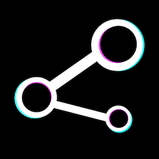
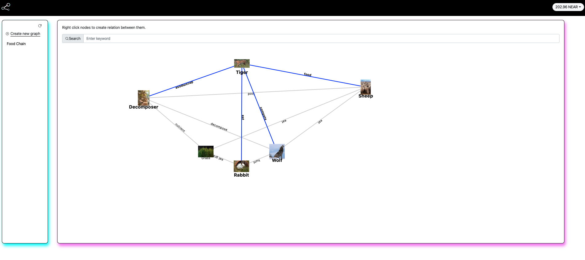

# Near Knowledge Graph

### Mint and build knowledge ecosystem worldwide



view [Demo](https://onehumanbeing.github.io/near_knowledge_graph/) here

this is a demo project while joining NCD Certification, I consider working on this demo because of it's value.
We use smart contract to store our assert and relations, such as metaverse lands, human social relationship.
It's cool to save them on contract.

I would like to make all those node in graph as a unique NFT which support NEPS, it will be a good way to encourage people minting on a same graph and share knowladge worldwide.

### Codes

```
----- contract                 smart contract by rust
 |    |
 |    |______scripts           scripts for calling contract in testnet
 |    |
 |    |______test.sh           unittest
 |    |______build.sh          build contact
 | 
 |___ frontend                 react, yarn start
```

### Snapshot


DFS loading graph at frontend 
```
  const getRootNode = useCallback(async (node_id, x, y, originAngle) => {
    // DFS loading graph
    try {
      if(x === centerX) {
        // means that this is a new graph, clean old data and reload everything
        setNodes({});
        setLinks({});
        graphData = emptyGraph();
      }
      // use get_node rpc
      let node = await getNode(node_id);
      // if node is loaded in recursion
      if(node.index in nodes) {
        // repeat loading
        return
      }
      graphData.nodes.push(parseNode(node, x, y));
      nodes[node.index] = node;
      setNodes(nodes);
      if(node.relations.length > 0) {
        // get all links from relation
        let relation_links = parseLink(node);
        for(let i=0;i<relation_links.length;i++) {
          // relation is repeat loading, continue
          if(relation_links[i].index in links) {
            continue;
          }
          if(relation_links[i].target in nodes) {
            graphData.links.push(relation_links[i]);
            links[relation_links[i].index] = relation_links[i];
          }
        }
        setLinks(links);
        // set a start angle for origin node to move
        let angle = Math.PI / node.relations.length;
        // var current_angle = Math.PI * 3 / 8;
        // distance r
        let r = 100;
        for(let i=0;i<node.relations.length;i++) {
          let related_node_id = node.relations[i][1];
          if(!(related_node_id in nodes)) {
            // calc a angle with direction and gen a new node, make it better to see
            let n = await getRootNode(related_node_id, x + r*Math.sin(originAngle), y + r*Math.cos(originAngle), originAngle + Math.PI / 4);
            originAngle += angle;
          }
        }        
      }
      console.log(graphData);
      // finally set the new graph data
      setGraphData(graphData);      
    } catch (error) {
      console.log({ error });
    } finally {
      //
    }
  });
```